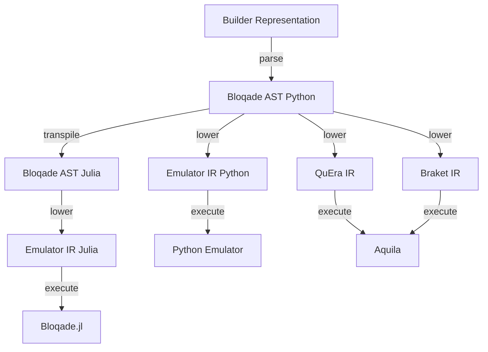

# Design Philosophy and Architecture

Given the heterogeneous nature of the hardware we target,
We have decided to use a compiler-based approach to our software
stack, allowing us to target different hardware backends
with the same high-level language. Below is a diagram of the
software stack in Bloqade.

## High-Level Builder Representation

When programming Bloqade using the Python API, the user constructs
a representation of an analog quantum circuit. This representation
is a *flattened* version of the actual analog circuit. *Flattened*
means that the user input is a linear sequence of operations where
the context of neighboring nodes in the sequence of instructions
can determine the program tree structure. The Bloqade AST describes
the actual analog circuit.

## Bloqade AST

The Bloqade AST is a representation of a quantum analog circuit for
neutral atom computing. It is a directed acyclic graph (DAG) with nodes
for different hierarchical levels of the circuit. The base node is the
`AnalogCircuit` which contains the geometry of the atoms stored as a
`AtomArragment` or `ParallelRegister` objects. The other part of the
circuit is the `Sequence`, which contains the waveforms that describe
the drives for the Ryberg/Hyperfine transitions of
each Rydberg atom. Each transition is represented by a `Pulse` including
a `Field` for the drive's detuning, Rabi amplitude, and Rabi phase
. A `Field` relates the spatial and temporal dependence
of a drive. The spatial modulates the temporal dependence of the
waveform. A DAG also describes the `Waveform` object. Finally, we
have basic `Scalar` expressions as well for describing the syntax
of real-valued continuous numbers.

## Bloqade Compilers and Transpilers

Given a user program expressed as the Bloqade AST, we can target various
backends by transforming from the Bloqade AST to other kinds of IR.
For example, when submitting a task to QuEra's hardware, we transform the
Bloqade AST to the IR that describes a valid program for the hardware.

This process is referred to as `lowering`, which in a general sense is a
transformation that takes you from one IR to another where the target IR
is specialized or has a smaller syntactical structure. `Transpiling`
corresponds to a transformation that takes you from
one language to equivalent expressions in another. For example, we
can transpile from the Bloqade AST in Python to the Bloqade AST in Julia.
The generic term for both of these types of transformation in Bloqade is
Code Generation. You will find various code generation implementations
in various `codegen` modules.