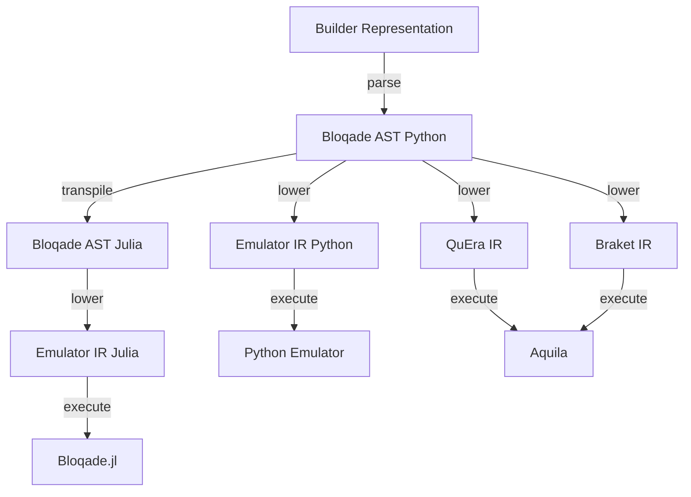

# Setting up Development Environment

Our development environment contains a set of tools we use
for development, testing, and documentation. This section
describes how to set up the development environment. We primarily
use [pdm](https://pdm.fming.dev/) to manage python environments
and dependencies.

## Setting up Python

We use [pdm](https://pdm.fming.dev/) to manage dependencies and virtual environment.
After cloning the repository, run the following command to install dependencies:

```bash
pdm install
```

You can also install different dependency groups:

- **dev**: dependencies for development

```bash
pdm install --dev
# or
pdm install -d
```

- **doc**: dependencies for building documentation

```bash
pdm install -G doc
```

## Useful PDM scripts

### Tests

You can run tests via

```bash
pdm run test
```

Or run tests and generate coverage via

```bash
pdm run coverage
```

will print out the coverage file level report in terminal.

```bash
pdm run coverage-html
```

This command generates an interactive html report in `htmlcov` folder.
This will show which specific lines are not covered by tests.

### Documentation

You can build documentation via

```bash
pdm run doc_build
```

Or run a local server to preview documentation via

```bash
pdm run doc
```

### Jupytext

You can sync jupyter notebooks and python scripts via

```bash
pdm run jupytext
```

this will help you development examples in jupyter notebook and python scripts simultaneously.

## Lint

We primarily use [ruff](https://github.com/charliermarsh/ruff) - an extremely fast linter for Python, and
[black](https://github.com/psf/black) as formatter. These has been configured into [pre-commit](https://pre-commit.com/) hooks. You can install pre-commit hooks to git via

```bash
pre-commit install
```

# Design Philosophy and Architecture

Given the heterogeneous nature of the hardware we target,
We have decided to use a compiler-based approach to our software
stack, allowing us to target different hardware backends
with the same high-level language. Below is a diagram of the
software stack in Bloqade.



## High-Level Builder Representation

When programming Bloqade using the Python API, the user constructs a representation of an analog quantum
circuit. This representation is a flattened version of
the actual analog circuit. Flattened means that the user
input is a linear sequence of operations where the context of neighboring nodes in the sequence
of instructions can determine the tree. The Bloqade AST describes the actual analog circuit.

## Bloqade AST

The Bloqade AST/ is a representation of a quantum analog circuit for
Nuetral atom computing. It is a directed acyclic graph (DAG) with nodes
for different hierarchical levels of the circuit. The base node is the
`AnalogCircuit` which contains the geometry of the atoms stored as a
`AtomArragment` or `ParallelRegister` objects. The Other part of the
circuit is the `Sequence`, which contains the waveforms that describe
the drives for the Ryberg/Hyperfine transitions of
each Rydberg atom. Each transition is represented by a `Pulse` including
a `Field` for the drive's detuning, rabi amplitude, and rabi phase
. A Field relates the spatial and temporal dependence
of a drive. The spatial modulates the temporal dependence of the
waveform. A DAG also describes the `Waveform` object. Finally, we have basic `Scalar` Expressions as well for describing
The syntax of Real valued continuous numbers.

## Bloqade Compilers

Given a user program expressed as the Bloqade AST, we can target various
backends by transforming from the Bloqade AST to some other kind of IR.
For example, when submitting a task to QuEra's hardware, we lower the
Bloqade AST to the IR that describes a valid program for the hardware.

We also support compiling the Bloqade AST to a more convenient IR for our
Python emulator backend. This IR is called the Emulator IR. The Emulator IR
represents the Bloqade AST that is more convenient for lowering
directly to a state-vector simulation.

We call the "lowering" procedure from the Bloqade AST to the various other
IR's code generation. The pattern we use for code generation is called
the "visitor pattern." The visitor pattern traverses a tree
structure and performs some action on each node while storing an internal
state. In Bloqade, the transpilling/lowering steps are typically called
"code generation" and will live in modules named `codegen`.
