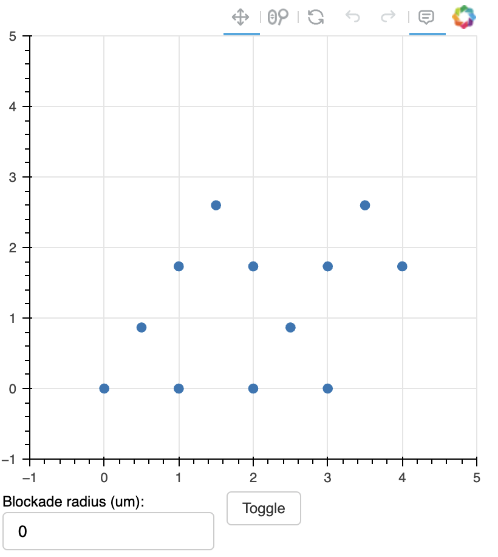

# Quick Start

All the sections below are self-contained, you can click on the links in the Table of Contents to read the relevant parts. 

## Navigating the Bloqade API

As you develop your Bloqade program, you are expected to rely on pop-up "hints" provided in your development environment to help you determine what the next part of your program should be.

### VS Code

In [VS Code](https://code.visualstudio.com/) this is automatic, just type the `.` and see what options pop up:


### JetBrains PyCharm

The same goes for [JetBrains PyCharm](https://www.jetbrains.com/pycharm/):


### Jupyter Notebook 

In a [Jupyter Notebook](https://jupyter.org/) you'll need to type `.` and then hit tab for the hints to appear:


### IPython

The same goes for [IPython](https://ipython.readthedocs.io/en/stable/):


## Defining Atom Geometry

You can import pre-defined geometries based on [Bravais lattices](https://en.wikipedia.org/wiki/Bravais_lattice) from `bloqade.atom_arrangement`. You may also specify a lattice spacing which dictates the spacing between the atoms as well as the number of atom sites in a certain direction.

```python
from bloqade.atom_arrangement import Square, Kagome

simple_geometry = Square(2, 4, lattice_spacing = 4.0)
more_complex_geometry = Kagome(2, 2, lattice_spacing = 2.0)
```

You can easily visualize your geometries as well with `.show()`:

```python
more_complex_geometry.show()
```
<figure markdown="span">
{ width="50%" }
</figure>


You can also add positions to a pre-defined geometry:

```python
from bloqade.atom_arrangement import Square

base_geometry = Square(2)
geometry_with_my_positions = base_geometry.add_position([(10,10), (20,20)])
```

As well as apply defects via `.apply_defect_density`. In the example below we apply a defect with a probability of 0.2:

```python
from bloqade.atom_arrangement import Square, Kagome

more_complex_geometry = Kagome(2, 2, lattice_spacing = 2.0)
defective_geometry = more_complex_geometry.apply_defect_density(0.2)
```

Or if you want to completely roll out your own atom geometry from scratch just use `add_position` by itself:

```python
from bloqade import start

my_geometry = start.add_position([(1,2), (3,4), (5,6)])
```

## Building Waveforms

After you've [defined a geometry](#defining-atom-geometry) you:

* Specify which level coupling to drive: `rydberg` or `hyperfine`
* Specify `detuning`, `rabi.amplitude` or `rabi.phase`
* Specify the [spatial modulation][local-control]

Which then leads you to the ability to specify a waveform of interest and begin constructing your pulse sequence. 
In the example below, we target the ground-Rydberg level coupling to drive with uniform [spatial modulation][local-control] for the Rabi amplitude. Our waveform is a piecewise linear one which ramps from $0$ to $5 \,\text{rad/us}$, holds that value for $1 \,\text{us}$ and then ramps back down to $0 \,\text{rad/us}$.

```python
from bloqade import start

geometry = start.add_position((0,0))
target_rabi_amplitude = geometry.rydberg.rabi.amplitude.uniform
waveform_applied = (
    target_rabi_amplitude
    .piecewise_linear(durations = [0.06, 1, 0.06], values = [0, 5, 5, 0])
)
```

You aren't restricted to just piecewise linear waveforms however, you can also specify:

* [`linear`]() - Define a transition from one value to another over a duration
* [`constant`]() - Define a fixed value over a duration
* [`piecewise_constant`]() - Define a step-wise function with specific durations for each step
* [`poly`]() - Define a polynomial waveform using coefficients over a duration


## Arbitrary Functions as Waveforms

For more complex waveforms it may provide to be tedious trying to chain together a large number of [`piecewise_constant`]() or [`piecewise_linear`]() methods and instead easier to just define the waveform as a function of time.

Bloqade lets you easily plug in an arbitrary function with `.fn`:

```python
from bloqade import start
from math import sin

geometry = start.add_position((0,0))
target_rabi_amplitude = geometry.rydberg.rabi.amplitude.uniform

def custom_waveform(t): 
    return 2.0 * sin(t)

custom_waveform_applied = (
    target_rabi_amplitude
    .fn(custom_waveform, duration = 3.0)
)
```

In this form you can immediately [emulate](#emulation) it if you'd like but to run this on [hardware](#submitting-to-hardware) you need to discretize it. The waveform on hardware has to either be: 

* Piecewise linear for Rabi amplitude and detuning terms of the Hamiltonian
* Piecewise constant for the Phase term of the Hamiltonian

Bloqade can automatically perform this conversion with `sample()`, all you need to do is specify the kind of interpolation and the size of the discretization step in time. Below we set the step duration to be $0.05 \,\text{us}$ with `"linear"` interpolation to give us a resulting piecewise linear waveform.

```python
custom_discretized_waveform_applied = (
    target_rabi_amplitude
    .fn(custom_waveform, duration = 3.0)
    .sample(0.05, "linear")
)
```

!!! note

    Programs that have custom functions as waveforms are not fully serializable. This means that when you are [saving and reloading results](#saving-and-loading-results), the original embedded program will be missing that custom waveform. You will still be able to analyze the saved results! 


## Slicing and Recording Waveforms

When you conduct [parameter sweeps](#parameter-sweeps) with your program, you may want to sweep over your program across  time. This will require "slicing" your waveforms, where you define the waveform of interest and then, using a variable with `.slice`, indicate the times at which the waveform duration should be cut short.

In the example below we define a simple piecewise linear waveform but slice it starting from a time duration of $0 \,\text{us}$ to values between $1$ to $2 \,\text{us}$.


```python
from bloqade import start
import numpy as np

sliced_program = (
    start.add_position((0, 0))
    .rydberg.rabi.amplitude.uniform.piecewise_linear(
        durations=[0.5, 2.5, 0.5], values=[0, 3.0, 3.0, 0]
    ).slice(start=0, stop="run_time")
)

run_times = np.linspace(1.0, 2.0, 10)
vars_assigned_program = sliced_program.batch_assign(run_time=run_times)
```

This program will run fine in [emulation](#emulation) but due to hardware constraints certain waveforms (such as those targeting the Rabi Amplitude), the waveform needs to start and end at $0 \,\text{rad}/\text{us}$. Thus, there needs to be a way to slice our waveform but also add an end component to that waveform. `.record` in Bloqade lets you literally "record" the value at the end of a `.slice` and then use it to construct further parts of the waveform.

In the program below the waveform is still sliced but with the help of `.record` a linear segment that pulls the waveform down to $0.0 \,\text{rad}/\text{us}$ from whatever its current value at the slice is in $0.7 \,\text{us}$ is added. 

```python
from bloqade import start
import numpy as np

sliced_program = (
    start.add_position((0, 0))
    .rydberg.rabi.amplitude.uniform.piecewise_linear(
        durations=[0.5, 2.5, 0.5], values=[0, 3.0, 3.0, 0]
    ).slice(start=0, stop="run_time")
    .record("waveform_value")
    .linear("rabi_value", 0.0, 0.7)
)

run_times = np.linspace(1.0, 2.0, 10)
vars_assigned_program = sliced_program.batch_assign(run_time=run_times)
```


## Waveforms with No Geometry

If you have multiple [atom geometries](#defining-atom-geometry) you'd like to apply a [pulse sequence](#building-waveforms) to or you simply don't want to worry about what atom geometry to start with, you can just build straight off of `start`:

```python
from bloqade import start

pulse_sequence = (
    start
    .rydberg.rabi.amplitude.uniform
    .constant(value=1.0, duration=1.0)
    .parse_sequence()
)
```

You can visualize your sequence as well with `.show()`:

```python
pulse_sequence.show()
```


And when you're content with it you just `.apply()` it on the geometries of your choice:

```python
from bloqade.atom_arrangement import Honeycomb, Kagome 

geometry_1 = Honeycomb(2, lattice_spacing = 6.0)
geometry_2 = Kagome(2, lattice_spacing = 6.0)

program_1  = geometry_1.apply(pulse_sequence)
program_2  = geometry_2.apply(pulse_sequence)
```

## Emulation

When you've completed the definition of your program you can use Bloqade's own emulator to get results.
The emulation performs the [time evolution][rydberg-hamiltonian] of the [analog Rydberg Hamiltonian][rydberg-hamiltonian].
Here we say we want to the program to be run and measurements obtained 1000 times.

```python
results = your_program.bloqade.python().run(1000)
```

!!! note
    If your atoms are particularly close together or the ODE solver gives you the following message:

    ```
    RuntimeError: DOP853/DOPRI5: Problem is probably stiff (interrupted).
    ```

    In which case you will need to specify the `interaction_picture=True` argument:

    ```python
    results = your_program.bloqade.python().run(1000, interaction_picture=True)
    ```

## Submitting to Hardware

To submit your program to hardware ensure you have your AWS Braket credentials loaded. You will need to use the [AWS CLI]() to do this.

Then it's just a matter of selecting the *Aquila* on Braket backend. Before going any further Bloqade provides two options for running your program on actual hardware:

* Using `.run` is blocking, meaning you will not be able to execute anything else while Bloqade waits for results
* Using `.run_async` lets you submit to hardware and continue any further execution, while also letting you query the status of your program in the queue.

In the example below we use `.run_async` to specify the program should be run and measurements obtained 1000 times.

```python
async_results = your_program.braket.aquila().run_async(1000)
```

We can see the status of our program via:

```python
async_results.fetch()
```
Which gives us the Task ID, a unique identifier for the task as well as the status of the task. In the example below the task is `Enqueued` meaning it has been successfully created and is awaiting execution on the cloud. When the task is actually running on hardware, the status will change to `Running`.
```
                                             task ID    status  shots
0  arn:aws:braket:us-east-1:XXXXXXXXXXXX:quantum-...  Enqueued    100
```


## Analyzing Results

When you've retrieved your results from either [emulation](#emulation) or [hardware](#submitting-to-hardware) you can generate a `.report()`:

```python
report = results.report()
```

For the examples below we analyze the results of a two atom program.

The report contains useful information such as:

* The raw bitstrings measured per each execution of the program
```python
report.bitstrings()
```
```
[array([[1, 1],
        [1, 1],
        [1, 1],
        ...,
        [1, 1],
        [1, 1],
        [1, 0]], dtype=int8)]
```

* The number of times each unique bitstring occurred:
```python
report.counts()
```
```
[OrderedDict([('11', 892), ('10', 59), ('01', 49)])]
```

* The Rydberg Density for each atom
```python
report.rydberg_densities()
```
```
                 0      1
task_number              
0            0.053  0.054
```

And can also provide useful visual information such as the state of your atoms and the bitstring distribution via:

```python
report.show()
```


## Parameter Sweeps

You can easily do parameter sweeps in emulation and on *Aquila* with variables. Bloqade automatically detects strings in your program as variables that you can later assign singular or multiple values to. 

In the example below, we define a program with a singular variable that controls the amplitude of the waveform.

```python
from bloqade import start

rabi_oscillations_program = (
    start.add_position((0, 0))
    .rydberg.rabi.amplitude.uniform.piecewise_linear(
        durations=[0.06, 3, 0.06], 
        values=[0, "rabi_amplitude", "rabi_amplitude", 0]
    )
)
```

We can assign a single fixed value to the variable:

```python
single_value_assignment = rabi_oscillations_program.assign(rabi_amplitude=3.5)
```

Or, to perform a sweep, we use `.batch_assign`:

```python
import numpy as np
rabi_amplitudes = np.linspace(1.0, 2.0, 20)

multiple_value_assignment = rabi_oscillations_program.batch_assign(rabi_amplitude=rabi_amplitudes)
```

This will actually create multiple versions of the program internally, with each program assigned a fixed value from the sweep. Bloqade will automatically handle the compilation of results from these multiple programs in order, meaning there is no major departure from what you saw in [analyzing the results](#analyzing-results) of your program.

You can also delay assignment of a value to a variable by first declaring it in `.args()` and then passing a value when you call `run`:

```python
delayed_assignment_program = rabi_oscillations_program.args(["rabi_amplitude"])
results = delayed_assignment_program.bloqade.python().run(100, args=(1.0,))
```

You can alternatively treat the program as a callable after using `.args()` (note the inverted order of arguments in the call!): 

```python
delayed_assignment_program = rabi_oscillations_program.args(["rabi_amplitude"])
callable_program = delayed_assignment_program.bloqade.python()
results = callable_program(1.0, shots=100)
```

Variables aren't just restricted to having values assigned to them, you can also [symbolically manipulate](#symbolic-parameters) them!

## Symbolic Parameters

[Variables](#parameter-sweeps) in Bloqade can also be symbolically manipulated, giving you even more flexibility when you construct your program.

In the example below, we externally declare a variable `my_var` that then has some arithmetic done on it to allow it to have a different value in a later part of the program:

```python
from bloqade import start, var

my_var = var("my_variable")
waveform_durations = [0.6, 1.0, 0.6]

geometry = start.add_position((0,0))
target_rabi_amplitude = geometry.rydberg.rabi.amplitude.uniform
rabi_waveform = (
    target_rabi_amplitude
    .piecewise_linear(durations=waveform_durations, 
                      values=[0.0, my_var, my_var, 0.0])
)
target_detuning = rabi_waveform.detuning.uniform
detuning_waveform = (
    target_detuning
    .piecewise_linear(durations=waveform_durations, 
                      values=[my_var-1.0, my_var*0.5, my_var/2, my_var+1.0 ])
)
```

You still perform variable assignment just like you normally would: 

```python
program = detuning_waveform.assign(my_variable=1.0)
```

You can also use Python's built-in `sum` if you want the sum of multiple variables as a value in your program. This is quite useful when it comes to needing to indicate a full duration for a waveform that doesn't need to be split up:

```python
from bloqade import start, var

variable_durations = var(["a", "b", "c"])

geometry = start.add_position((0,0))
target_rabi_amplitude = geometry.rydberg.rabi.amplitude.uniform
rabi_waveform = (
    target_rabi_amplitude
    .piecewise_linear(durations=variable_durations, 
                      values=[0.0, 1.5, 1.5, 0.0])
)
target_detuning = rabi_waveform.detuning.uniform
detuning_waveform = (
    target_detuning
    .constant(duration=sum(variable_durations),
              value=16.2)
)
```
We later assign values and Bloqade will automatically handle the summation:

```python
program = detuning_waveform.assign(a=0.5, b=1.2, c=0.5)
```


## Saving and Loading Results

You can save your results in JSON format using Bloqade's `save` function:

```python
from bloqade import start, save

your_program = ...
emulation_results = your_program.bloqade.python().run(100)
hardware_results = your_program.braket.aquila.run_async(100)

save(emulation_results, "emulation_results.json") 
save(hardware_results, "hardware_results.json") 
```

And later reload them into Python using the `load` function:

```python
from bloqade import load
emulation_results = load("emulation_results.json")
hardware_results = load("hardware_results.json")
```

[local-control]: background.md#local-control
[rydberg-hamiltonian]: background.md#rydberg-many-body-hamiltonian