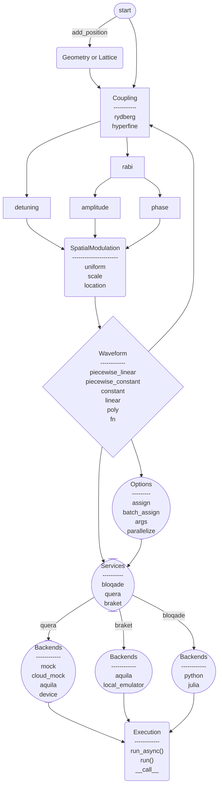

# Build Workflow

```mermaid

flowchart TD
  ProgramStart(["start"])

  Geometry("Geometry or Lattice")

  Coupling["Coupling
  -----------
  rydberg
  hyperfine"]

  Detuning["detuning"]
  Rabi["rabi"]

  Amplitude["amplitude"]
  Phase["phase"]

  SpaceModulation("SpatialModulation
  ----------------------
  uniform
  scale
  location
  ")
  Waveform{"Waveform
  ------------
  piecewise_linear
  piecewise_constant
  constant
  linear
  poly
  fn
  "}

  Options(["Options
  ---------
  assign
  batch_assign
  args
  parallelize
  "])

  Services(["Services
  ----------
  bloqade
  quera
  braket"])

  QuEraBackends(["Backends
  ------------
  mock
  cloud_mock
  aquila
  device"])

  BraketBackends(["Backends
  ------------
  aquila
  local_emulator"])

  BloqadeBackends(["Backends
  ------------
  python
  julia"])

  Execution("Execution
  ------------
  run_async()
  run()
  __call__")

  ProgramStart -->|add_position| Geometry;
  Geometry --> Coupling;
  ProgramStart --> Coupling;

  Coupling --> Detuning;
  Coupling --> Rabi;

  Rabi --> Amplitude;
  Rabi --> Phase;

  Detuning --> SpaceModulation;
  Amplitude --> SpaceModulation;
  Phase --> SpaceModulation;

  SpaceModulation --> Waveform;

  Waveform --> Coupling;
  Waveform --> Services;
  Waveform --> Options;
  Options --> Services;

  Services -->|quera| QuEraBackends;
  Services -->|braket| BraketBackends;
  Services -->|bloqade| BloqadeBackends;
  QuEraBackends --> Execution;
  BraketBackends --> Execution;
  BloqadeBackends --> Execution;

  click ProgramStart "../reference/bloqade/builder/start/";

```

  <!--  -->

<!--
<body>
  <pre class="mermaid">

  </pre>

  
</body> -->
